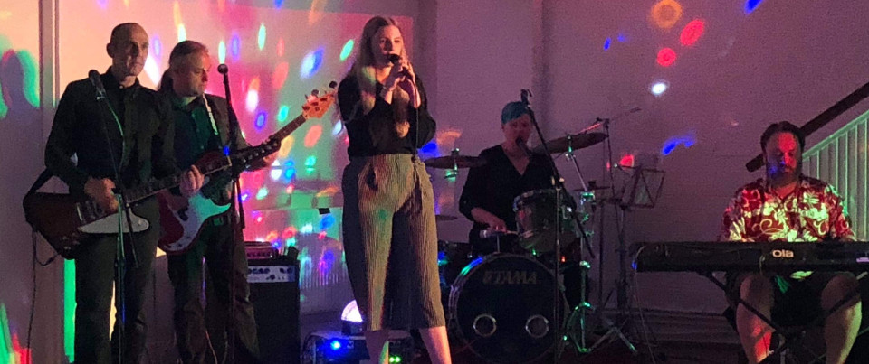



## Now Booking for 2019

Betty And The Blushtones are now taking bookings for 2019 and beyond.

Contact us using the details below.

## About

Built around the incredible vocal talent of our lead singer Sophie, the band formed in 2017. 

Our current line up consists of Sophie (vocals), Jim (keyboards), Helen (drums), Dave (guitar) and Jonathan (Bass).

We're based in and around Bradford, UK

Dave and Jonathan also play with <a href="http://playingforkicks.co.uk/">Playing for Kicks</a>
